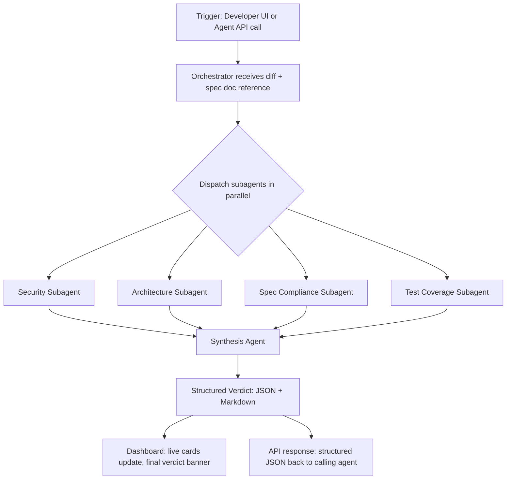

# Squadrune — App Flow

## 6.1 Two Entry Points

Squadrune has two ways a review run gets triggered:

1. **Human-initiated**: a developer opens the dashboard, pastes a PR link (or local diff) + a link to the spec/ticket doc, and clicks "Run Squad"
2. **Agent-initiated**: an external coding agent (Bob 2.0, or any agent) calls `POST /verify` directly as a step in its own workflow, passing the diff and doc reference programmatically

Both paths converge on the same orchestrator.

## 6.2 High-Level Flow

## 6.3 Detailed Step-by-Step (Human path)

1. Developer opens the Squadrune dashboard
2. Pastes a PR diff (or connects a repo + selects a PR) and a link/upload for the spec doc
3. Clicks "Run Squad" — this hits `POST /runs`
4. Dashboard opens a WebSocket connection to `/runs/{id}/stream`
5. As each subagent starts, finishes, or flags something, its Agent Card on the dashboard updates live (status: queued → running → done, with a running log of what it found)
6. Once all four subagents report back, the Synthesis Agent merges results into one prioritized verdict
7. Dashboard shows a final Verdict Banner: pass / needs changes / blocked, with each finding grouped by severity and linked to the exact diff line
8. Run is saved to history with a timestamp and duration, feeding the "time saved" analytics view

## 6.4 Detailed Step-by-Step (Agent path)

1. An external coding agent (e.g., Bob 2.0) finishes generating a change and, before reporting "done" to its user, calls `POST /verify` with the diff + doc reference
2. Squadrune runs the exact same parallel subagent pipeline
3. Returns a structured JSON verdict synchronously (or a webhook callback for longer runs)
4. The calling agent parses the verdict and decides: proceed, self-correct and retry, or escalate to a human — this is the "reduces manual effort and rework" story for the agent-facing side

## 6.5 Dashboard Screens

- **Live Run view** — the four Agent Cards + streaming log + final verdict banner (default landing screen during an active run)
- **History view** — list of past runs, sortable by date, verdict, duration — this is where the "impact" numbers live (average turnaround, issues caught over time)
- **Run Detail view** — full breakdown of one past run, every subagent's raw findings
- **Connect view** — where a developer pastes/uploads a repo, PR, and spec doc, or where they'd retrieve their API key for agent integration
